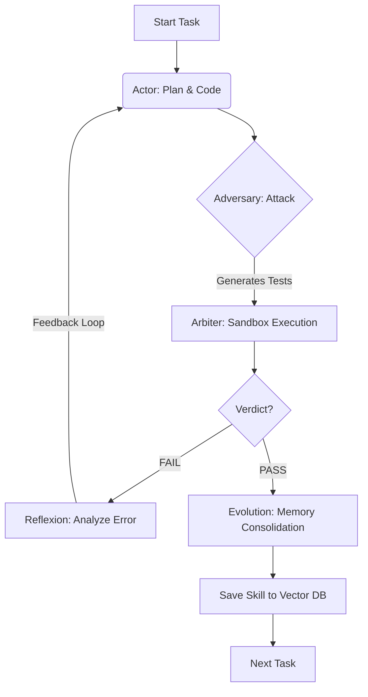
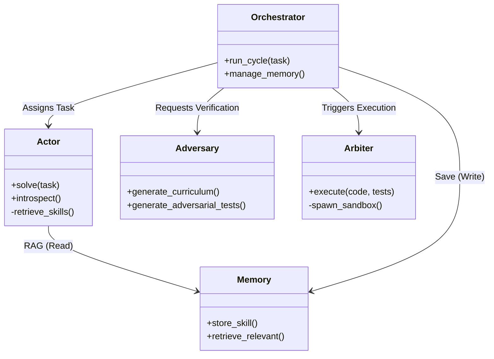
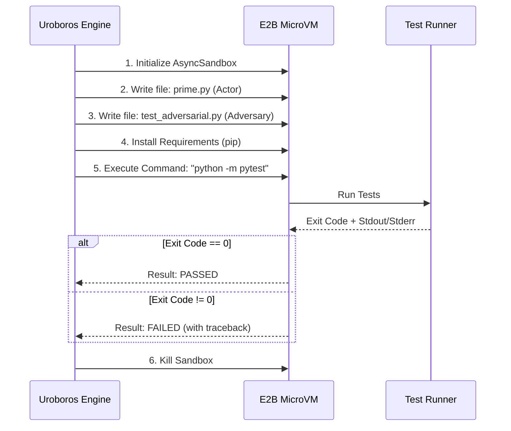
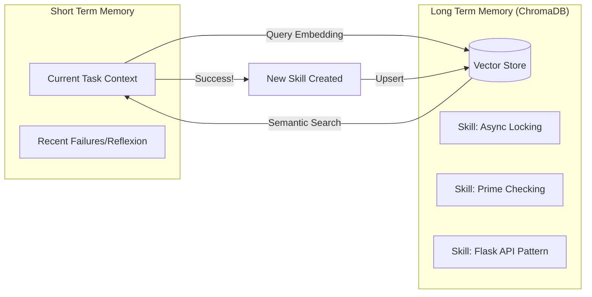

# Uroboros System Architecture

This document outlines the architectural design of the Uroboros autonomous software agent. The system is designed around the principle of **Adversarial Co-Evolution**, where a Builder (Actor) and a Tester (Adversary) compete to produce robust code.

## 1. The Core Feedback Loop (The "Uroboros Cycle")

The central engine is an infinite loop that drives recursive improvement. The system does not stop until the code passes strict adversarial verification.

### Components in the Loop

- **Actor:** Generates Python code patches.
- **Adversary:** Analyzing the Actor's code to generate "Killer Tests" (edge cases, security exploits).
- **Arbiter:** An isolated execution environment (Firecracker MicroVM via E2B) that runs the code against the tests.
- **Reflexion:** If the tests fail, the stderr output is fed back to the Actor as a critique.

## 2. System Architecture & Data Flow

The system follows a modular Monorepo structure. Data flows from the high-level orchestration layer down to specific worker agents and infrastructure.

## 3. The Sandbox Execution Model (Arbiter)

To ensure safety and prevent "hallucinated" success, all code execution happens in an ephemeral environment.

## 4. The Evolutionary Memory (Voyager)

The system learns by persisting successful strategies ("Skills") to a Vector Database. This prevents the agent from making the same mistake twice.

## 5. Directory Structure Mapping

How the architecture maps to the codebase:

| Component | Directory | Responsibility |
|-----------|-----------|----------------|
| **Orchestrator** | `src/uroboros/main.py` | The while loop, error handling, and retry logic. |
| **Actor** | `src/uroboros/actor/` | Code generation, tool synthesis, and introspection. |
| **Adversary** | `src/uroboros/adversary/` | Curriculum generation and adversarial testing (GAST). |
| **Arbiter** | `src/uroboros/arbiter/` | E2B sandbox management and output parsing. |
| **Memory** | `src/uroboros/memory/` | ChromaDB wrapper and skill retrieval logic. |
| **LLM Gateway** | `src/uroboros/llm/` | OpenAI client wrapper with retry logic and cost tracking. |

## 6. Safety Guardrails

The architecture includes strict boundaries to prevent runaway costs or damage:

- **CostManager:** Hard limits on dollar spend per session (`src/uroboros/llm/cost_manager.py`).
- **Sandboxing:** Network-isolated MicroVMs prevent local filesystem access.
- **Sanitization:** Input/Output filters (`clean_code_block`) strip markdown artifacts to prevent syntax errors.
- **Max Retries:** The orchestrator enforces a maximum number of attempts before failing gracefully.
